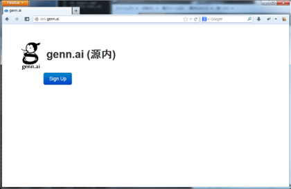
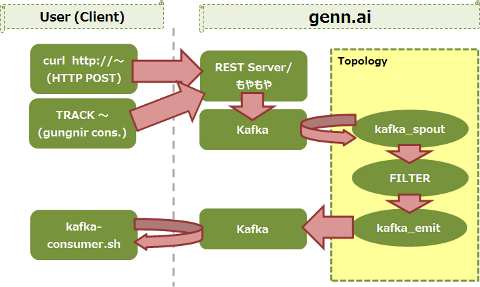

# genn.ai チュートリアル
## 環境の前提
このチュートリアルでは以下のような環境を前提として記載しています。
これらをご準備頂くか、またはご自身の環境に合わせて読み替えてご利用下さい。

**OS**
- Mac OSX 10.8.5
- CentOS 5.8 x86_64

**Java**

- Oracle JDK 1.6.0_43 x86\_64
- ライブラリ使用者ユーザへの`JAVA_HOME`環境変数設定

## 環境の構築
genn.aiにアクセスするための環境をつくるには、前提となる環境に加え、GitHubアカウント、genn.aiアクセスキー、genn.aiアクセスライブラリが必要となりますので、以下の説明を参考に環境を整備してください。

１. GitHubアカウントの取得

genn.aiでキーを発行するにはGitHubアカウントが必要となりますので、アカウントをお持ちで無い方はここで登録をしてください。（詳細は省略します）  

[https://github.com/](https://github.com/)  

２. アクセスキーの取得

- genn.aiにアクセスするためには専用のアクセスキーを取得する必要があります。まず [http://dev.genn.ai/](http://dev.genn.ai/) にアクセスし、"Sign Up"をクリックして下さい。        

- 先ほど登録したGitHubアカウントでログインします。

- genn.aiからGitHub情報へのアクセス許可を求めるページが表示されますので、「許可」してください。

- 許可すると自動的にgenn.aiページに戻り、発行されたアクセスキーが表示されます。以後、このキーを用いてコマンドラインからgenn.aiを操作してゆきます。

    

３. クライアントライブラリファイルをダウンロード

アクセスキーが表示されたページにあるリンクから、ライブラリファイルをダウンロードしてください。

４. クライアントライブラリの展開

先ほどダウンロードしたファイル、gungnir-client.tar.gzを任意のディレクトリで展開してください(以下の例では展開場所を /usr/local 配下としました)。展開したあとは、`PATH` 環境変数設定を行ってください。

        # cd /usr/local
        # tar xzvf ~/gungnir-client.tar.gz
        # export PATH=/usr/local/gungnir-client/bin:$PATH

ちなみに、設定ファイルは以下のような内容になっています。  

        # cat /usr/local/gungnir-client/conf/gungnir.yaml
        > ...
        > gungnir.thrift.server: "dev.genn.ai:9190"
        > gungnir.rest.server: "dev.genn.ai:9191"
        > ...

以上で環境の設定は完了です。

## 使ってみよう！

ここではgenn.aiを使ったミニマムな処理を通してイベント処理を実際に行ってみたいと思います

### (genn.aiに)接続する
genn.aiに接続するには、前述のライブラリパッケージの中にある**gungnir**コマンドを使用します。パラメータとして、接続ユーザ、アクセスキーを渡して実行すれば、そこはもうgenn.aiの世界です！

以下の例では、接続ユーザを**gennaitaro**、先にGithubアカウントを連携させたときに取得したアクセスキー**167668259f3e**を与えて接続しています。

    $ gungnir -u gennaitaro -p 167668259f3e
    Nov 14, 2013 12:14:41 AM com.twitter.finagle.Init$ apply
    INFO: Finagle version 6.5.1 (rev=57de9b06e9d9456abaa98a5b02f085cc029cde41) built at 20130626-111057
    Gungnir server connected... dev.genn.ai/54.238.99.212:9190
    Welcome gennaitaro
    　
    gungnir> 

正常に接続が完了すると、gungnirというプロンプトが表示されてコマンド入力待ちとなります。これを以後gungnirコンソールと呼びます。

### コマンドを与える
genn.aiの世界に入ったので、なにかコマンドを与えてみましょう。
以下の例では、後に使うトポロジの実行計画を表示する`EXPLAIN`コマンドを投入しています。

    gungnir> EXPLAIN;
    gungnir>

いまはgenn.aiへ何の処理も登録していないので、何も返答は返ってきません。ここでは、特にエラーが出なければ問題ありません。

### スキーマ(SCHEMA)を作る
ではまず、スキーマを作りましょう。スキーマとは、genn.aiに投入するデータの形のことです。genn.aiにはJSONの形式でデータを投入するため、ここではその形を指定します。

それでは、**userAction**というスキーマを登録しましょう。userAction は userId と hotelId のSTRING型フィールド２つをもつスキーマです。
このためには`CREATE TOUPLE`コマンドを用います。

    gungnir> CREATE TUPLE userAction (
    gungnir>   userId STRING,
    gungnir>   hotelId STRING
    gungnir> );
    OK
    gungnir>

次に、**commitAction**というスキーマも登録しておきます。こちらはSTRING型２つ、TIMESTAMP型、INT型の４フィールドを持っています。

    gungnir> CREATE TUPLE commitAction (
    gungnir>   userId STRING,
    gungnir>   hotelId STRING,
    gungnir>   checkin TIMESTAMP('yyyy-MM-dd HH:mm:ss'),
    gungnir>   nights INT
    gungnir> );
    OK
    gungnir>

それでは、登録したスキーマを一覧表示させて確認しましょう。
このためには`SHOW TUPLES`コマンドを使います。

    gungnir> SHOW TUPLES;
    [\
     {\
        "name":"userAction",\
        "owner":"gennaitaro",\
        "createTime":"2013-11-01T00:00:00.000Z"\
     },\
     {\
        "name":"commitAction",\
        "owner":"gennaitaro",\
        "createTime":"2013-11-01T00:00:00.000Z"\
     }\
    ]
    gungnir>

この結果より、２つのスキーマ、userActionとcommitActionが登録されたことを確認できます。  

> 補足："\"の記号は、実際には行が続いており 1行続きであることを表しています。

さらに登録されたスキーマの内容をそれぞれ確認してみましょう。
このためには`DESC TUPLE`コマンドを用います。

    gungnir> DESC TUPLE userAction;
    {\
        "name":"userAction",\
        "fields":{\
            "userId":{"type":"STRING"},\
            "hotelId":{"type":"STRING"}\
        },\
        "partitioned":"-",\
        "owner":"gennaitaro",\
        "createTime":"2013-11-01T00:00:00.000Z"\
    }
    gungnir> DESC TUPLE commitAction;
    {\
        "name":"commitAction",\
        "fields":{\
            "userId":{"type":"STRING"},\
            "hotelId":{"type":"STRING"},\
            "checkin":{"type":"TIMESTAMP","pattern":"yyyy-MM-dd HH:mm:ss"},\
            "nights":{"type":"INT"}\
        },\
        "partitioned":"-",\
        "owner":"gennaitaro",\
        "createTime":"2013-11-01T00:00:00.000Z"\
    }
    gungnir>.

お気づきと思いますが、作成時に指定したフィールド以外に owner、createTime、partitioned が追加されており、順に、所有者・作成日時・...となっています。ここでは詳しく解説を行いませんので、興味のある方は [DDLリファレンス](./ddl.html) を参照ください。

### トポロジ(Topology)を作る

トポロジとは、genn.ai内部に持たれる「データをどう受け取り、そのデータをどう処理してゆくか」のロジックのことです。これは、genn.ai独自のクエリ言語を使って、スキーマ作成と同様に作ってゆくことができます。

それではトポロジを作ってみましょう。

まずデータを読み上げる処理ですが、これは`FROM ～ USING ～`の形を使って行います。  

    FROM userAction AS ua USING kafka_spout()
    FILTER ua.userId REGEXP '^[A-Z]{2}[012][0-9]{7}$'
    EMIT userId, hotelId USING kafka_emit('${TOPOLOGY_ID}_user')

今のgenn.aiは、外部から受け取ったデータをまずKafka(※)上に格納します。このためトポロジとしてはKafkaからデータを読み上げることから処理をスタートさせることになります。
そのためここでは `USING`に kafka_spout() を持たせます。

> ここで、「Kafkaってなに？」という方もおられると思いますが、ここでは「JSONデータをためておく場所」くらいに考えておいてください。

そして、`FROM userAction AS ua` ですが、これはKafkaから読み込んだJSONデータを、先に定義したuserActionのスキーマに従って解釈するように指示する定義です。

    FROM userAction AS ua USING kafka_spout()

次に、処理内容を記述してゆきます。ここではUserIdが アルファベット大文字２文字+数字0～2から始まる数字8桁であるデータだけを抜き出す、FILTER処理としました。FILTERでは、==、!=、LIKEなどのさまざまな条件が使用できますが、ここでは正規表現で記述してみます。

    FILTER ua.userId REGEXP '^[A-Z]{2}[012][0-9]{7}$'

最後に、`EMIT ～ USING ～` で処理の結果をKafkaへ格納する(書き戻す)処理を記述します。
その際、処理結果に対して`${TOPOLOGY_ID}_user` という**名前**を付けるよう指定しています。
ここにある`${TOPOLOGY_ID}`は、このトポロジが実際に登録されたときに付与されるid(トポロジid)を使う、という変数指定です。
（この**名前**は後述の結果取得の際に使用します）

    EMIT userId, hotelId USING kafka_emit('${TOPOLOGY_ID}_user')

では、gungnirコンソールからトポロジを作成してみましょう。

    gungnir> FROM userAction AS ua USING kafka_spout()
    gungnir> FILTER ua.userId REGEXP '^[A-Z]{2}[012][0-9]{7}$'
    gungnir> EMIT userId, hotelId USING kafka_emit('${TOPOLOGY_ID}_user')
    gungnir> ;
    OK
    gungnir>

次に、最初に使った`EXPLAIN`コマンドを用いて作成したトポロジの実行計画を確認してみましょう。

    gungnir> EXPLAIN;
    SPOUT_0(\
      kafka_spout(), [userAction(userId STRING, hotelId STRING)]\
    )\
     -S-> PARTITION_1\
    PARTITION_1(identity grouping)\
     -S-> FILTER_2\
    FILTER_2(userAction.userId REGEXP ^[A-Z]{2}[012][0-9]{7}$)\
     -S-> EMIT_3\
    EMIT_3(kafka_emit(${TOPOLOGY_ID}_user), [userId, hotelId])
    gungnir> 

ここまでで、トポロジの構成を作り上げることができました。
これを実際にgenn.aiに処理してもらうためには、これをgenn.aiに登録する必要があります。

それでは、以下でこの登録を行います。
これにより作成したロジック(トポロジ)で、ストリームデータを処理する機構が準備されます。

    gungnir> SUBMIT TOPOLOGY;
    OK
    gungnir>

> 補足：  
> `FROM`コマンドなどで作成された直後のトポロジは genn.ai に "登録" されておらず、genn.ai のセッションワークメモリ上にあります。処理を行える状態とするには "登録"(`SUBMIT`) の操作が必要となります。

正常に登録された場合、これが想定通り実行状態となったかを確認しましょう。
このためには`DESC TOPOLOGY`コマンドを用います。

下記の例では status が **RUNNING** であることから正常な実行状態と判断できます。

    gungnir> DESC TOPOLOGY;
    { \
        "id":"5284a5b7e4b08627b67aecd3", \
        "explain":"SPOUT_0(\
            kafka_spout(), \
            [ \
                userAction( \
                    userId STRING, \
                    hotelId STRING \
                ), \
                commitAction( \
                    userId STRING, \
                    hotelId STRING, \
                    checkin TIMESTAMP(yyyy-MM-dd HH:mm:ss), nights INT \
                ) \
            ] \
            )￥n \
            -S-> PARTITION_1\nPARTITION_1(identity grouping)￥n \
            -S-> EMIT_2￥n \
            EMIT_2( \
               kafka_emit(${TOPOLOGY_ID}_user), \
               [userId, hotelId, name, image] \
        )", \
        "status":"RUNNING", \
        "owner":"gennaitaro", \
        "createTime":"2013-11-01T00:00:00.000Z", \
        "summary":{ \
            "name":"gungnir_5284a5b7e4b08627b67aecd3", \
            "status":"ACTIVE", \
            "uptimeSecs":37, \
            "numWorkers":1, \
            "numExecutors":3, \
            "numTasks":3 \
        } \
    }
    
    gungnir>

そして、トポロジの停止や再開、結果取得などの操作にはここで表示されるid(**トポロジid**)必要となりますのでどこかに控えておきましょう。
また、この文字列が変数${TOPOLOGY_ID}の部分に入ることになります。

さらにこの**トポロジid**はトポロジの停止や削除など、トポロジを直接指定して操作するときに使います。

> 参考：
> 
> - Topologyの停止、削除方法
>
>         gungnir> STOP TOPOLOGY 5284a5b7e4b08627b67aecd3;
>         OK
>         gungnir> DROP TOPOLOGY 5284a5b7e4b08627b67aecd3;
>         OK
>         gungnir>
>         
> 
> - セッションワークメモリ上にあるTopologyを削除
>
>         gungnir> CLEAR;
>         OK
>         gungnir> DESC TOPOLOGY;
>         FAILED: Topology is not registered
>         gungnir>
>

### ここまででどんなものができたのか

先ほどの `SUBMIT TOPLOGY` でトポロジは起動している状態となっています。トポロジを含めた全体概略イメージを示すと以下のようになります。

このあとに説明する方法でデータを投入すると、トポロジへデータが流れ、処理され、結果がKafkaに格納される(`kafka_emit()`による)こととなります。

なお後述しますが、kafkaに格納された(書き戻された)結果データを見るためには、ダウンロードしたライブラリに含まれる**kafka-consumer.sh**を使います。

### データを投入する

データの投入は通常、RESTのインターフェイスを用いて行いますが、デバッグの目的でgungnirコンソールからの投入も可能となっています。ここでは双方の方法を試してみましょう。

まずデバッグ用の`TRACK`コマンドを用いて、**gungnirコンソールから**の投入を実施してみましょう。

    gungnir> TRACK userAction {"userId":"AA01234567", "hotelId":"226979"};
    
    OK
    gungnir> 

正常に投入できるようであれば、次に実際の利用で使われる**RESTインターフェイスから**投入してみましょう。

このためには、投入するためのURLを確認する必要があります。URLは、  
`http://dev.genn.ai:9191/gungnir/v1.0/track/ユーザid/スキーマ名`  

の形で、各利用者ごと、スキーマごとに作られています。
そして、ここで使われている**ユーザid**は、gungnirコンソール上から `DESC USER`コマンドで確認します。

    gungnir> DESC USER;
    {\
      "id":"5271d4c9e4b08627b67aeccd",\
      "name":"gennaitaro",\
      "password":"0A042lHaOOWdvEyYCK7r1piXIT6TYwUVD6V99RNitig=",\
      "createTime":"2013-11-01T00:00:00.000Z"\
    }
    gungnir> 

この結果内でidとして表示される**ユーザid**と、データ投入先の**スキーマ名**であるuserActionを当てはめ、以下のようなURLを作ります。  

http://dev.genn.ai:9191/gungnir/v1.0/track/**5271d4c9e4b08627b67aeccd**/**userAction**

それでは、ここにデータを投入してみましょう。
これは先のgungnirコンソールは終了せず、新たなターミナル画面で実施してください。

    $ curl -v -H "Content-type: application/json" -X POST \
        -d '{"userId":"AA11234567", "hotelId":"226979"}' \
        http://dev.genn.ai:9191/gungnir/v1.0/track/5271d4c9e4b08627b67aeccd/userAction
    >
    >* About to connect() to dev.genn.ai port 9191
    >*   Trying 54.238.99.212... connected
    >* Connected to dev.genn.ai (54.238.99.212) port 9191
    ...(省略)...
    $ 
    

このとき、上手く投入ができていれば、HTTPとして以下のようなレスポンスを得られます。

    HTTP/1.1 200 OK
    Content-Length: 0
    Date: Fir, 01 Nov 2013 12:00:00 GMT

先に少し触れた通り、genn.aiは、(1)このRESTで受け止めたJSONをまずKafkaにのせ、(2)さらに各トポロジがこれを拾い上げる、という流れで処理を実行してゆきます。

### 結果をみる

トポロジ記述のところでご説明したとおり、処理結果は`kafka_emit()`によってkafkaに格納されます。格納されたデータを取得して確認するためには、gungnirコマンドと同じディレクトリにある**kafka-consumer.shスクリプト**※を使用します。  
このスクリプトは、引数として**処理結果につけた名前**を必要としますが、 
この名前は「トポロジを作ってみる」の項で同関数に与えた`${TOPOLOGY_ID}_user`になります。

もっとも、この中の`${TOPOLOGY_ID}`部分は `DESC TOPOLOGY;`コマンドの結果に表示されるid(**トポロジid**)に置き換えて出力されるため、指定する引数は`5284a5b7e4b08627b67aecd3_user`という文字列となります。

それでは、結果を取り出してみましょう。

    $ kafka-consumer.sh 5284a5b7e4b08627b67aecd3_user
    2013-11-01 12:00:00,000 kafka.tools.SimpleConsumerShell$ \
                       INFO (Logging.scala:61) Starting consumer...

    > 2013-11-01 12:00:00,000 kafka.tools.SimpleConsumerShell$ \
    >    INFO (Logging.scala:61) consumed: {"userId":"AA01234567","hotelId":"226979"}
    > 2013-11-01 12:00:00,000 kafka.tools.SimpleConsumerShell$ \
    >    INFO (Logging.scala:61) consumed: {"userId":"AA11234567","hotelId":"226979"}
    > ...

「データを投入してみる」の項で、 `TRACK`と`curl`コマンドの計２回、データを投入したので処理結果が２つ返ってきます。  
なお、kafka-consumer.shスクリプトは、Kafkaへデータをポーリングし続けるので、２行の結果を表示した後も終了しません※。genn.aiに新たなデータが投入され、処理されれば、その数秒後に結果が表示されます。

> ※ 終了は\[CTRL\]+\[C\]です。

これを確認するため、kafka-consumer.shはそのままに、別のターミナルからまたgenn.aiコンソールを起動しデータを投入してみましょう。

    $ curl -v -H "Content-type: application/json" -X POST \
        -d '{"userId":"AA21234567", "hotelId":"226979"}' \
        http://dev.genn.ai:9191/gungnir/v1.0/track/5271d4c9e4b08627b67aeccd/userAction

すると、先のkafka-consumer.shコンソールに、以下の行が追加で表示されるはずです。

    > 2013-11-19 22:30:19,317 kafka.tools.SimpleConsumerShell$ \
    >    INFO (Logging.scala:61) consumed: {"userId":"AA21234567","hotelId":"226979"}

では最後に、userIdを "AA31234567"としてデータを投入してみましょう。この投入についてkafka-consume.shコンソールに処理結果は表示されません。

    $ curl -v -H "Content-type: application/json" -X POST \
        -d '{"userId":"AA31234567", "hotelId":"226979"}' \
        http://dev.genn.ai:9191/gungnir/v1.0/track/5271d4c9e4b08627b67aeccd/userAction

これにより、トポロジの中で記述したFILTER処理がきちんと動作していることが確認できた、ということになります。

## チュートリアルの終わりに

いかがでしたでしょうか。
genn.aiを使用することでストリーム処理を簡単に行えることがご理解いただけたと思います。
これにより、最近注目を集めてきているストリーミング処理を体験してみること、活用してみることが出来ます。
みなさまもぜひトライしてみて下さい。
